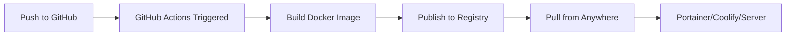

# Quick Deploy Guide

## TL;DR - Deploy in 3 Steps

1. **Push code to GitHub** → GitHub automatically builds Docker image
2. **Wait 5-10 minutes** → Image published to registry
3. **Pull and run** → Use docker-compose in Portainer/Coolify/anywhere

**No local building required!**

---

## How Automated Building Works



When you push code:
1. `.github/workflows/docker-build.yml` automatically triggers
2. Builds multi-architecture image (AMD64 + ARM64)
3. Publishes to GitHub Container Registry (ghcr.io)
4. Optional: Also publishes to Docker Hub

---

## Choose Your Registry

### Option 1: GitHub Container Registry (Recommended)

**Pros:**
- No setup required (uses GITHUB_TOKEN automatically)
- Free for public repos
- Private packages included with GitHub plan
- Integrated with your code repository

**Cons:**
- Less familiar to some users
- Requires making package public or setting up token

**Image URL:**
```
ghcr.io/YOUR_GITHUB_USERNAME/claude_web:latest
```

### Option 2: Docker Hub (Optional)

**Pros:**
- More familiar to most users
- Public images are free
- No authentication needed for public pulls
- Better discoverability

**Cons:**
- Requires setup (Docker Hub account + secrets)
- Free tier has pull rate limits
- Separate from your GitHub repo

**Image URL:**
```
YOUR_DOCKERHUB_USERNAME/claude-web:latest
```

---

## Setup Instructions

### GitHub Container Registry (Default - Already Working!)

1. **Push your code:**
   ```bash
   git add .
   git commit -m "Setup automated builds"
   git push origin main
   ```

2. **Wait for build:**
   - Go to GitHub → **Actions** tab
   - Wait for "Build and Publish Docker Image" to complete (~5-10 min)

3. **Make package public:**
   - GitHub profile → **Packages** → `claude_web`
   - **Package settings** → Change visibility → **Public**

4. **Use in Portainer:**
   ```yaml
   image: ghcr.io/YOUR_USERNAME/claude_web:latest
   ```

**That's it!** See [PORTAINER.md](PORTAINER.md) for detailed Portainer setup.

---

### Docker Hub (Optional)

1. **Create Docker Hub account:**
   - Go to https://hub.docker.com
   - Create free account

2. **Generate access token:**
   - Docker Hub → Account Settings → Security
   - **New Access Token**
   - Name: `github-actions`
   - Permissions: Read, Write, Delete
   - Copy the token (shown only once!)

3. **Add secrets to GitHub:**
   - Your repo → **Settings** → **Secrets and variables** → **Actions**
   - Click **New repository secret**
   - Add two secrets:
     - Name: `DOCKERHUB_USERNAME`, Value: `your-dockerhub-username`
     - Name: `DOCKERHUB_TOKEN`, Value: `paste-token-here`

4. **Push code again:**
   ```bash
   git push origin main
   ```

5. **Images now publish to both registries!**
   - GitHub: `ghcr.io/YOUR_USERNAME/claude_web:latest`
   - Docker Hub: `YOUR_DOCKERHUB_USERNAME/claude-web:latest`

---

## Quick Deploy Templates

### Portainer (Recommended)

Use `docker-compose.portainer.yml`:

1. Portainer → **Stacks** → **Add stack**
2. Name: `claude-web`
3. Upload file: `docker-compose.portainer.yml`
4. Edit these two lines:
   - Replace `YOUR_GITHUB_USERNAME`
   - Replace `your-api-key-here`
5. **Deploy**

Or see detailed guide: [PORTAINER.md](PORTAINER.md)

### Command Line

```bash
docker run -d \
  --name claude-web \
  -p 8000:8000 \
  -e CLAUDE_API_KEY=sk-ant-your-key \
  -v claude-data:/app/data \
  --restart unless-stopped \
  ghcr.io/YOUR_USERNAME/claude_web:latest
```

### Docker Compose (Production)

```bash
# Copy production template
cp docker-compose.production.yml docker-compose.yml

# Edit with your details
nano docker-compose.yml

# Start
docker-compose up -d
```

---

## Available Tags

Every push creates multiple tags:

| Tag | Example | Use Case |
|-----|---------|----------|
| `latest` | `ghcr.io/you/claude_web:latest` | Always newest, auto-updates |
| `sha-XXXXXX` | `ghcr.io/you/claude_web:sha-f409a2b` | Specific commit, reproducible |
| `v1.0.0` | `ghcr.io/you/claude_web:v1.0.0` | Release version, stable |
| `v1.0` | `ghcr.io/you/claude_web:v1.0` | Minor version, patch updates |
| `v1` | `ghcr.io/you/claude_web:v1` | Major version, minor updates |

**Recommendation:**
- **Production:** Use semantic versions (`v1.0.0`)
- **Staging:** Use `latest`
- **Rollback:** Use SHA tags (`sha-abc123`)

---

## Updating Your Deployment

### Method 1: Portainer (Easiest)

1. Push new code to GitHub
2. Wait for build to complete (check Actions tab)
3. Portainer → Your stack → **Pull and redeploy**

Done! New version deployed.

### Method 2: Command Line

```bash
# Pull latest image
docker pull ghcr.io/YOUR_USERNAME/claude_web:latest

# Recreate container
docker-compose up -d --force-recreate
```

### Method 3: Auto-Update with Watchtower

Add to your docker-compose:

```yaml
watchtower:
  image: containrrr/watchtower
  volumes:
    - /var/run/docker.sock:/var/run/docker.sock
  environment:
    - WATCHTOWER_POLL_INTERVAL=300
  command: --cleanup
```

Now containers auto-update every 5 minutes!

---

## Troubleshooting

### "Image not found"

1. Check build completed: GitHub → **Actions** → Verify green checkmark
2. Check package is public: GitHub profile → **Packages** → `claude_web` → Public
3. Verify username is correct in image URL

### "Authentication required"

Package is private. Either:
- Make it public (GitHub → Packages → Settings → Change visibility)
- Or add GitHub token to Portainer (see [PORTAINER.md](PORTAINER.md))

### Build failed

1. Go to GitHub → **Actions**
2. Click failed workflow
3. Check error logs
4. Common issues:
   - Syntax error in Dockerfile
   - Missing dependency in requirements.txt
   - Workflow file syntax error

### Container won't start

```bash
# Check logs
docker logs claude-web

# Common fixes:
- Verify CLAUDE_API_KEY is set
- Check port 8000 isn't already in use
- Ensure data volume has write permissions
```

---

## Files Reference

| File | Purpose |
|------|---------|
| `.github/workflows/docker-build.yml` | GitHub Container Registry builds (automatic) |
| `.github/workflows/docker-hub.yml` | Docker Hub builds (optional, needs secrets) |
| `docker-compose.portainer.yml` | Simple template for Portainer |
| `docker-compose.production.yml` | Advanced production template |
| `PORTAINER.md` | Detailed Portainer setup guide |
| `DEPLOYMENT.md` | Complete deployment documentation |

---

## Next Steps

1. **First time?** Follow GitHub Container Registry setup above
2. **Using Portainer?** See [PORTAINER.md](PORTAINER.md)
3. **Want Docker Hub?** Follow Docker Hub setup above
4. **Need help?** Check [DEPLOYMENT.md](DEPLOYMENT.md) for detailed docs

---

## What's Happening Behind the Scenes

```yaml
# .github/workflows/docker-build.yml does this:

on:
  push:                          # ← When you push code
    branches: [main, master]

jobs:
  build:
    - Checkout code
    - Setup Docker Buildx         # ← Multi-platform builds
    - Login to GHCR              # ← Automatic with GITHUB_TOKEN
    - Build for AMD64 + ARM64    # ← Works on all servers
    - Push to ghcr.io            # ← Published automatically
    - Security scan with Trivy   # ← Find vulnerabilities
```

**You don't need to do anything!** Just push code and images appear in the registry.
