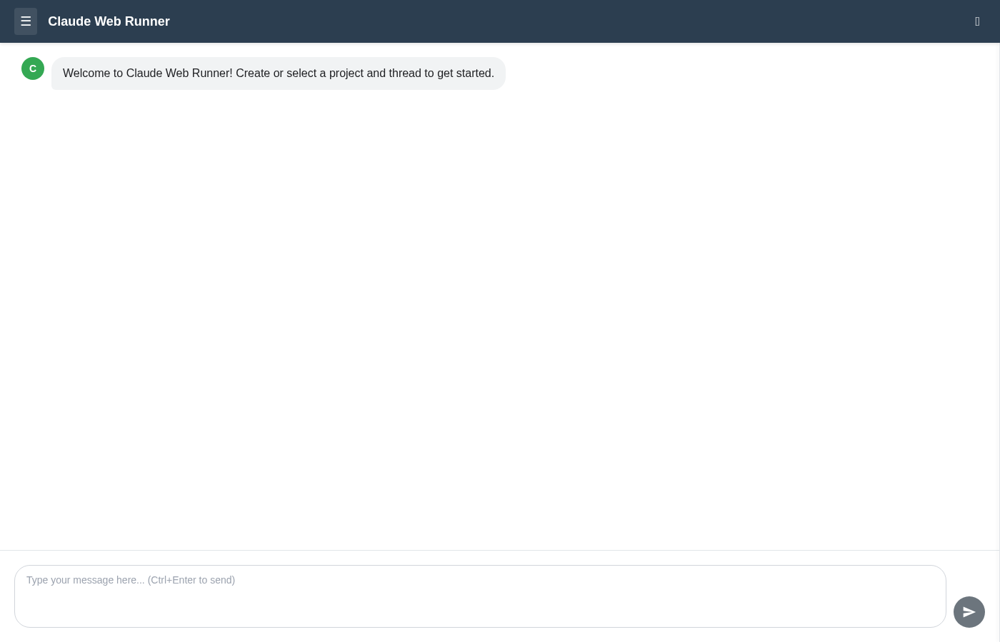
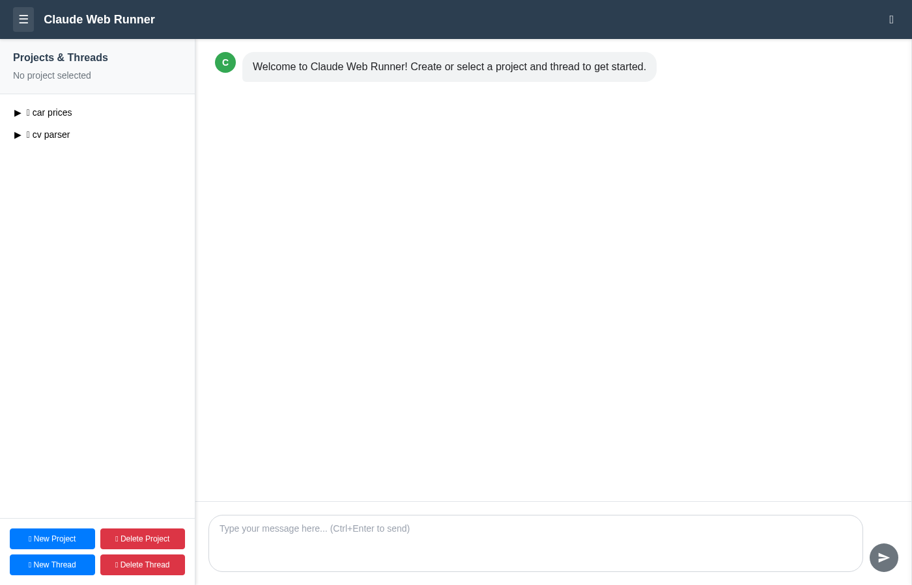
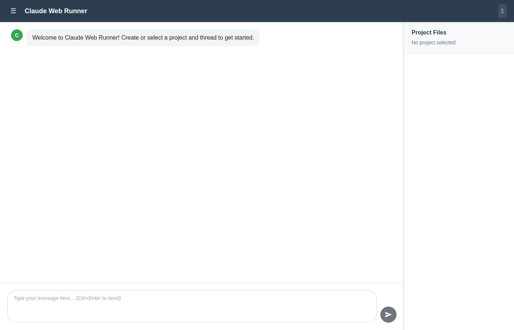

# Claude Web Runner

A modern web interface for interacting with Claude Code through projects and threads.


## Features

- 💬 **Clean Chat Interface** - Modern chat bubbles with real-time responses
- 📁 **Project Management** - Organize work into separate project folders
- 🧵 **Thread Management** - Multiple chat conversations within each project
- 📂 **File Browser** - View and edit files created by Claude
- 🔄 **Session Persistence** - Automatic session management with Claude CLI
- ⌨️ **Keyboard Shortcuts** - Ctrl+Enter to send, Escape to close sidebars
- 📱 **Mobile Responsive** - Works on desktop and mobile devices
- 🛠️ **Auto-Setup** - New projects configured with Claude Code templates

## Screenshots

<div align="center">

### Main Interface


### Projects Sidebar


### File Browser


</div>

## Quick Start

### Option 1: Docker (Recommended)

```bash
docker run -d \
  --name claude-web \
  -p 8000:8000 \
  -e CLAUDE_API_KEY=sk-ant-your-key \
  -v claude-data:/app/data \
  ghcr.io/YOUR_USERNAME/claude_web:latest
```

Get your API key from [platform.claude.com/settings/keys](https://platform.claude.com/settings/keys)

Then open http://localhost:8000

### Option 2: Docker Compose

```bash
# Copy example environment file
cp .env.example .env

# Edit .env and add your API key
nano .env

# Start services
docker-compose up -d
```

### Option 3: Local Development

```bash
# Install dependencies
pip install -r requirements.txt

# Install Claude Code CLI
curl -fsSL claude.ai/install.sh | bash
# Or: npm install -g @anthropic-ai/claude-code

# Start the application
python scripts/start.py
```

Opens automatically at http://localhost:8000

## Deployment

### Pre-built Images (Production)

Use pre-built Docker images from GitHub Container Registry:

```yaml
# docker-compose.yml
version: '3.8'
services:
  claude-web:
    image: ghcr.io/YOUR_USERNAME/claude_web:latest
    ports:
      - "8000:8000"
    environment:
      - CLAUDE_API_KEY=sk-ant-your-key
    volumes:
      - claude-data:/app/data
    restart: unless-stopped
```

**Deployment Guides:**
- [Portainer](PORTAINER.md) - GUI deployment with Portainer
- [Full Guide](DEPLOYMENT.md) - Railway, Render, Fly.io, DigitalOcean, Coolify

**Images are automatically built on every push via GitHub Actions.**

### Coolify Deployment

1. Create new service → Docker Compose
2. Point to this repository
3. Select `docker-compose.coolify.yml`
4. Set `CLAUDE_API_KEY` from [platform.claude.com/settings/keys](https://platform.claude.com/settings/keys)
5. Deploy

## Usage

### Getting Started

1. Click **☰** menu to open projects sidebar
2. Create a new project or select existing
3. Create a thread within the project
4. Start chatting with Claude!

### Interface

- **Header**: ☰ (projects) and 📁 (files) toggles
- **Left Sidebar**: Project/thread tree with management buttons
- **Right Sidebar**: File browser for project files
- **Chat Area**: Conversation with Claude
- **Input**: Auto-resize text area with send button

### Keyboard Shortcuts

- **Ctrl+Enter** - Send message
- **Escape** - Close sidebars (mobile)

## Architecture

### Single-Service Web Application

- **Backend** (`src/`): Flask API + Claude CLI integration
- **Frontend** (`web/`): Modern HTML/CSS/JS
- **Data** (`data/projects/`): Project workspaces
- **Templates** (`templates/`): Claude Code project templates

### Project Structure

```
claude_web/
├── src/                    # Flask backend + Claude integration
│   ├── app.py              # REST API
│   ├── claude_wrapper.py   # Claude CLI session management
│   └── template_manager.py # Project template system
├── web/                    # Frontend assets
│   ├── index.html
│   ├── css/styles.css
│   └── js/app.js
├── data/projects/          # Project workspaces
├── templates/              # Claude Code templates
├── docker/                 # Docker configuration
└── scripts/                # Utility scripts
```

### Key Components

1. **Flask Backend** (`src/app.py`): REST API on port 8000
2. **Claude Integration** (`src/claude_wrapper.py`): Manages CLI sessions
3. **Template System** (`src/template_manager.py`): Auto-initializes projects
4. **Web Frontend** (`web/`): Modular HTML/CSS/JS

### Session Management

- Each thread = unique Claude CLI session
- Session IDs stored in thread metadata
- Conversation continuity via `--resume` flag
- Background job queue for async processing

### Template System

Every new project includes:
- **CLAUDE.md** - Project instructions
- **.claude/settings.json** - Shared configuration
- **.claude/commands/** - Custom slash commands (/help, /status, /test)
- **.gitignore** - Proper ignore rules
- **README.md** - Project documentation

## Environment Variables

| Variable | Required | Default | Description |
|----------|----------|---------|-------------|
| `CLAUDE_API_KEY` | ✅ | - | API key from [platform.claude.com/settings/keys](https://platform.claude.com/settings/keys) |
| `FLASK_ENV` | No | `production` | Environment mode |
| `FLASK_DEBUG` | No | `0` | Debug mode (0 or 1) |
| `FLASK_PORT` | No | `8000` | Server port |

## API Endpoints

```
GET  /projects                              # List all projects
POST /project/new                           # Create new project
GET  /project/:name/threads                 # Get project threads
POST /project/:name/thread/new              # Create new thread
POST /project/:name/thread/:id/message      # Send message to Claude
GET  /project/:name/files                   # Get project file tree
GET  /project/:name/file?path=:path         # View specific file
POST /project/:name/file/:path/save         # Save file content
DELETE /project/:name/thread/:id            # Delete thread
DELETE /project/:name                       # Delete project
GET  /status/:job_id                        # Get async job status
GET  /health                                # Health check
```

## Development

### Development Setup

```bash
git clone <repository-url>
cd claude_web
pip install -r requirements.txt

export FLASK_DEBUG=1
python scripts/start.py
```

### Running Tests

```bash
python scripts/test_api.py
```

### Docker Development

```bash
docker-compose up -d
docker logs -f claude-web
```

## Troubleshooting

**"Failed to fetch" errors:**
- Ensure Flask server is running on port 8000
- Check `pip install flask-cors`

**Claude CLI not found:**
- Install Claude CLI: `curl -fsSL claude.ai/install.sh | bash`
- Or: `npm install -g @anthropic-ai/claude-code`

**Container won't start:**
- Verify `CLAUDE_API_KEY` is set
- Check port 8000 isn't in use: `sudo lsof -i :8000`
- View logs: `docker logs claude-web`

## GitHub Actions

Automated Docker builds are configured:
- Builds on every push to main/master
- Multi-architecture (AMD64 + ARM64)
- Published to GitHub Container Registry
- Security scanning with Trivy
- See [SETUP_COMPLETE.md](SETUP_COMPLETE.md) for setup instructions

## Contributing

- 🧪 Test thoroughly on desktop and mobile
- 📱 Mobile-first development approach
- 🎨 Maintain UI consistency
- 🔧 Document all changes
- 🛡️ Validate user inputs

## License

MIT License - See [LICENSE](LICENSE) file

## Support

- **Issues** - [GitHub Issues](https://github.com/YOUR_USERNAME/claude_web/issues)
- **Discussions** - [GitHub Discussions](https://github.com/YOUR_USERNAME/claude_web/discussions)
- **Deployment Help** - See [DEPLOYMENT.md](DEPLOYMENT.md) or [PORTAINER.md](PORTAINER.md)

---

**Built for the Claude Code community** - Transform Claude Code into a powerful web platform that works everywhere.
